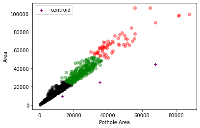

# Pothole-Segmentation-and-Classification-YoloV8-and-DecisionTrees

Welcome! This project is an extension of my final year project  

### Approach
The approach is as follows:
* Perform instance segmentation to detect the potholes. I tested Detectron 2, YoloV5 and YoloV8.
* Extract structural features from segmented images such as height, width and area of potholes.
* Performs KMeans clustering on extracted features to specify pothole severity classes.
* Build an ML classifier to classify pothole severity. Decision Tree gave the best results.

Approach diagram

Sample segmentation predictions

Elbow plot for KMeans

Cluster plot for 'pothole area' vs 'bounding box area'

